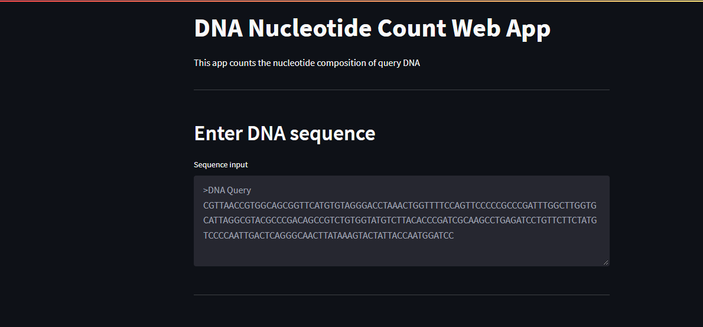
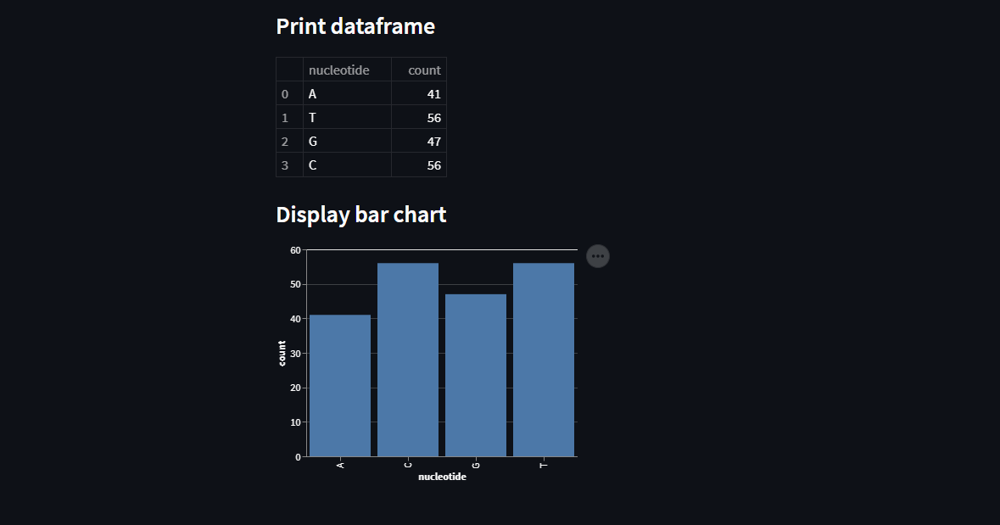

# Bioinformatics dna count app

# Español
App que muestra los nucleótidos dentro de una cadena de ADN. 
La información se muestra a través de un dataframe y un gráfico.
Incluye un script para generar cadenas de ADN e insetarlas en la app.

# English
App that displays the nucleotides within a DNA strand. 
The information is displayed through a dataframe and a graph.
It includes a script to generate DNA strands and insert them into the app.

# Technologies
* Python 3.x
* Pillow 9.0.0
* pandas 1.3.5
* streamlit 1.3.1
* altair 4.1.0

# Instalación / Installation
1 - Descargar el repo.

2 - Correr, en terminal, el archivo requirements.txt.

3 - Correr, en terminal, el comando streamlit run dnaapp.py. Se abrirá en el puerto 8501.

English
1 - Download the repo.

2 - Run, in terminal, the file requirements.txt.

3 - Run, in terminal, the command streamlit run dnaapp.py. It will open on port 8501.

# Screenshots

Ingresar cadena de ADN / Input DNA query

Gráfico de nucleótido / Nucleotides graph

