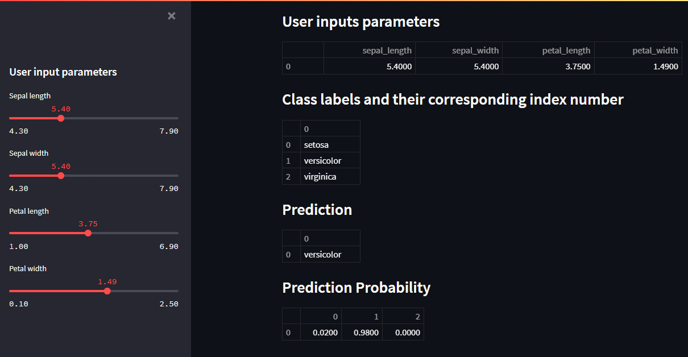

# Simple stock price app

# Español
App que muestra la predición de tipo de iris según los parámetros dados. 
Proyecto de machine learning.

# English
App that shows the iris type prediction according to the given parameters. 
Machine learning project.

# Technologies
* Python 3.x
* pandas 1.3.5
* streamlit 1.3.1
* scikit_learn 1.0.2

# Instalación / Installation
1 - Descargar el repo.

2 - Correr, en terminal, el archivo requirements.txt.

3 - Correr, en terminal, el comando streamlit run irisapp.py. Se abrirá en el puerto 8501.

English
1 - Download the repo.

2 - Run, in terminal, the file requirements.txt.

3 - Run, in terminal, the command streamlit run irisapp.py. It will open on port 8501.

# Screenshots

Página principal / Main page

