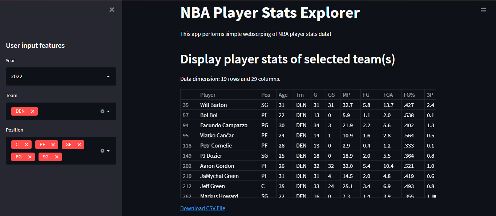

# Basketball app

# Español
App que muestra las estadísticas de los jugadores de un equipo de la NBA en un respactivo año.

# English
App that shows the statistics of the players of an NBA team in a respective year.
# Technologies
* Python 3.x
* pandas 1.3.5
* streamlit 1.3.1
* matplotlib 3.1.3
* numpy 1.18.1
* seaborn 0.10.1

# Instalación / Installation
1 - Descargar el repo.

2 - Correr, en terminal, el archivo requirements.txt.

3 - Correr, en terminal, el comando streamlit run basketball_app.py. Se abrirá en el puerto 8501.

English
1 - Download the repo.

2 - Run, in terminal, the file requirements.txt.

3 - Run, in terminal, the command streamlit run basketball_app.py.py. It will open on port 8501.

# Screenshots

Página principal / Main page

