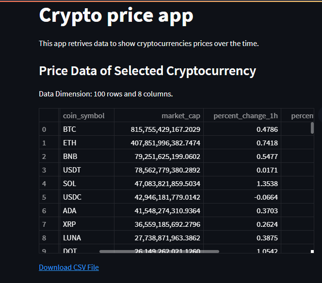
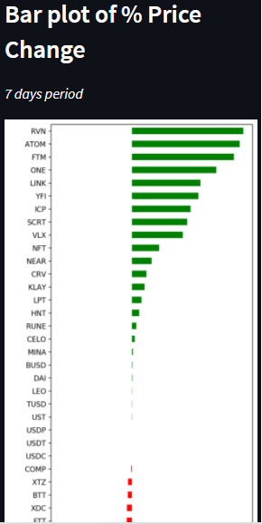
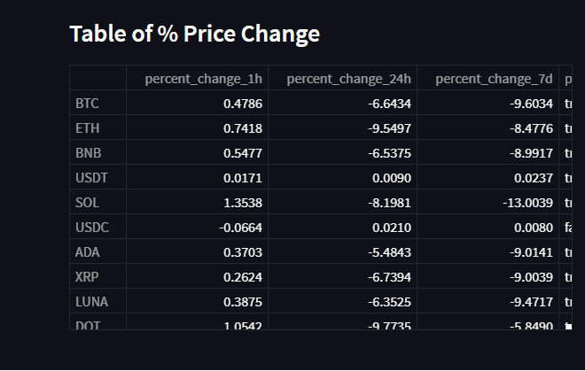

# Cryptocurrency app

# Español
App que muestra la variación del precio de las 100 crytomonedas mas demandas del mercado. 
Mustran los cambios por hora, por día y por semana.

# English
App that shows the price variation of the 100 most demanded cryptocurrencies in the market. 
It shows the changes per hour, per day and per week.

# Technologies
* beautifulsoup4 4.10.0
* matplotlib 3.1.3
* pandas 1.3.5
* Pillow 9.0.0
* requests 2.27.0
* streamlit 1.3.1

# Instalación / Installation
1 - Descargar el repo.

2 - Correr, en terminal, el archivo requirements.txt.

3 - Correr, en terminal, el comando streamlit run cryptoapp.py. Se abrirá en el puerto 8501.

English
1 - Download the repo.

2 - Run, in terminal, the file requirements.txt.

3 - Run, in terminal, the command streamlit run cryptoapp.py. It will open on port 8501.

# Screenshots

Página principal / Main page

Gráfico de barras / Barchart plot

Tabla de precios / Price dataframe

