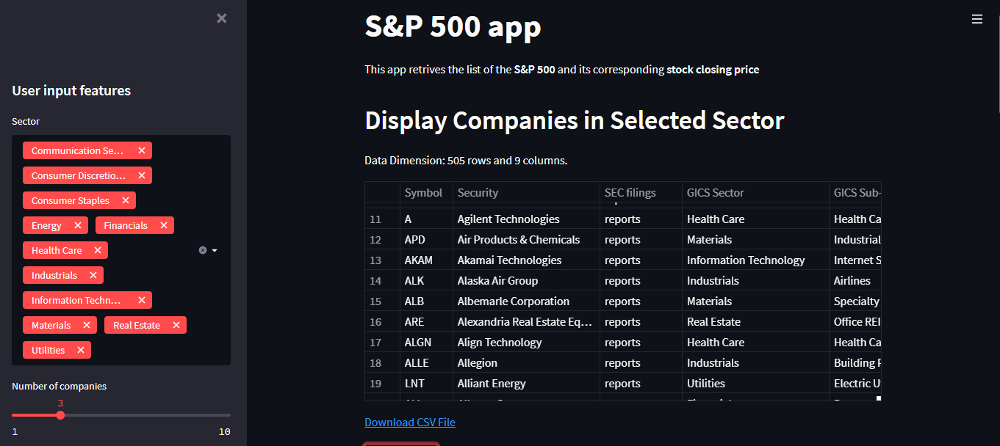
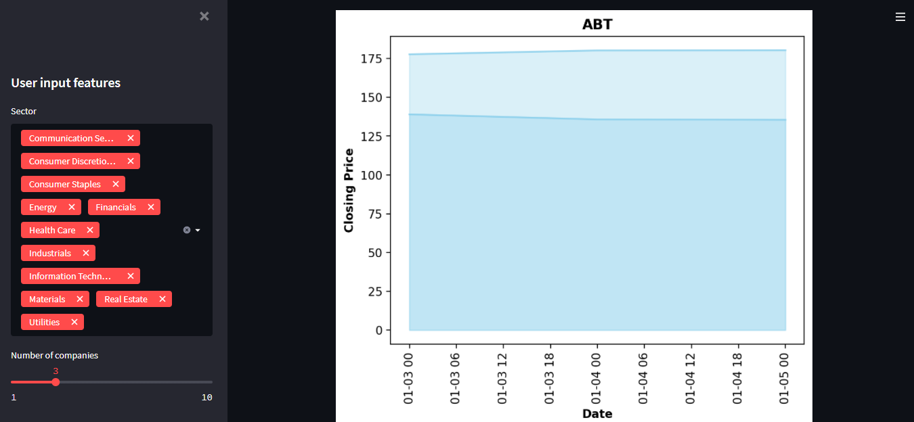

# S&P500 app

# Español
App que muestra las estadísticas de las 500 compañías más grandes de EE.UU.
Se muestra un dataset y los gráficos de cierre de cada compañía.

# English
App that shows the statistics of the 500 largest U.S. companies.
A dataset and closing graphs are shown for each company.

# Technologies
* Python 3.x
* pandas 1.3.5
* streamlit 1.3.1
* matplotlib 3.1.3
* numpy 1.18.1
* seaborn 0.10.1
* yfinance 0.1.68

# Instalación / Installation
1 - Descargar el repo.

2 - Correr, en terminal, el archivo requirements.txt.

3 - Correr, en terminal, el comando streamlit run sp500app.py. Se abrirá en el puerto 8501.

English
1 - Download the repo.

2 - Run, in terminal, the file requirements.txt.

3 - Run, in terminal, the command streamlit run sp500app.py. It will open on port 8501.

# Screenshots

Página principal / Main page

Gráficos de cierre / Closing plots

