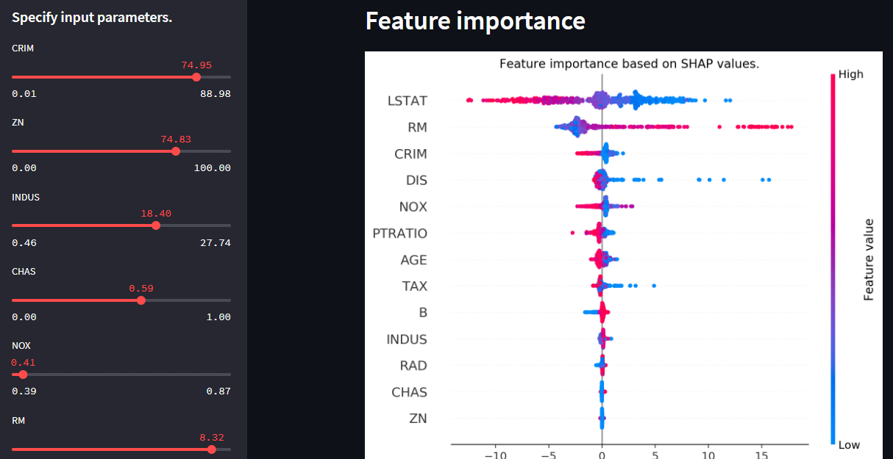

# House Regression

# Español
App que muestra la predicción de los precios de las casas en Boston según parametros.

# English
App that shows the prediction of house prices in Boston according to parameters.

# Technologies
* Python 3.x
* pandas 1.3.5
* streamlit 1.3.1
* scikit_learn 1.0.2
* shap 0.40.0
* matplotlib 3.1.3

# Instalación / Installation
1 - Descargar el repo.

2 - Correr, en terminal, el archivo requirements.txt.

3 - Correr, en terminal, el comando streamlit run houseapp.py. Se abrirá en el puerto 8501.

English
1 - Download the repo.

2 - Run, in terminal, the file requirements.txt.

3 - Run, in terminal, the command streamlit run houseapp.py. It will open on port 8501.

# Screenshots

Página principal / Main page

