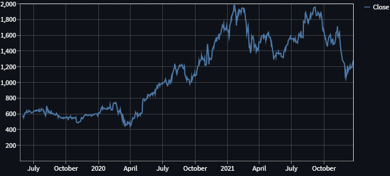

# Simple stock price app

# Español
App que muestra las variaciones del cierre y del volumen de una compañía.

# Technologies
* Python 3.x
* pandas 1.3.5
* streamlit 1.3.1
* yfinance 0.1.68

# Instalación / Installation
1 - Descargar el repo.

2 - Correr, en terminal, el archivo requirements.txt.

3 - Correr, en terminal, el comando streamlit run myapp.py. Se abrirá en el puerto 8501.

English
1 - Download the repo.

2 - Run, in terminal, the file requirements.txt.

3 - Run, in terminal, the command streamlit run myapp.py. It will open on port 8501.

# Screenshots

Página principal / Main page

Gráfico de cierre / Close graph

Gráfico de volumen / Volume graph

